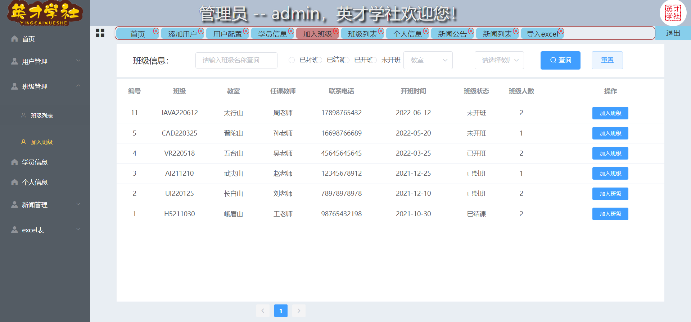

# studygroup

#### 介绍
英才学社管理系统，使用vue2全家桶+element-ui+UEidtor+XLSX+ECharts，实现基础的管理系统，包含班级和学生的管理、个人信息的展示修改、富文本评论、首页图表、excel表格导入导出功能
后端使用express+mysql+jwt等实现前端数据接口，包含有token校验
#### 软件架构
软件架构说明
    studentadmin 后端接口
    studentpro   前端页面

#### 安装教程

1.  git clone https://gitee.com/explorer_fei/studygroup.git  拉取项目
2.  使用编辑器打开，在终端的项目目录下使用 npm install 安装依赖
3.  studentpro 使用 npm run serve 启动；studentadmin使用 npm run start（若全局安装的有nodemon可以使用npm run dev）
4.  打开启动后生成的浏览器路径地址，在浏览器中打开访问

#### 使用说明
1. 需要创建mysql数据库，名称：stu   账号密码：root 123456 并导入sql表中数据，或者自行更改配置
2. 后端需要安装nodejs 后才能正常启动

#### 效果展示

1. 登录

2. 首页

3. 添加用户

4. 用户列表

5. 班级列表/添加班级

6. 加入班级

7. 学员信息

8. 个人信息

9. 新闻发布

10. 新闻详情编辑

11. excel表

#### 参与贡献

1.  Fork 本仓库
2.  新建 Feat_xxx 分支
3.  提交代码
4.  新建 Pull Request

#### 特技

1.  使用 Readme\_XXX.md 来支持不同的语言，例如 Readme\_en.md, Readme\_zh.md
2.  Gitee 官方博客 [blog.gitee.com](https://blog.gitee.com)
3.  你可以 [https://gitee.com/explore](https://gitee.com/explore) 这个地址来了解 Gitee 上的优秀开源项目
4.  [GVP](https://gitee.com/gvp) 全称是 Gitee 最有价值开源项目，是综合评定出的优秀开源项目
5.  Gitee 官方提供的使用手册 [https://gitee.com/help](https://gitee.com/help)
6.  Gitee 封面人物是一档用来展示 Gitee 会员风采的栏目 [https://gitee.com/gitee-stars/](https://gitee.com/gitee-stars/)
